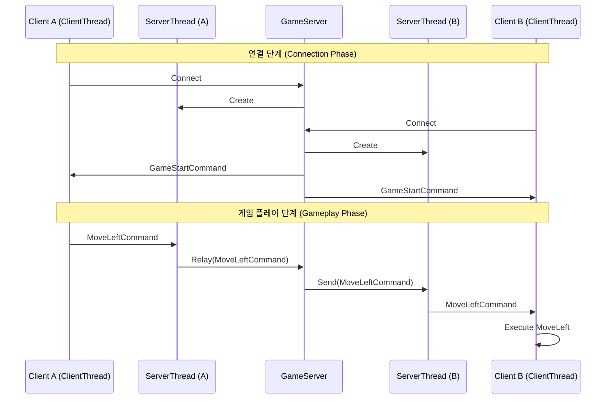

# 네트워크 아키텍처 (Network Architecture)

이 문서는 테트리스 게임의 네트워크 아키텍처를 설명합니다. 스레딩 모델, 클래스 역할, 그리고 통신 흐름을 포함합니다.

## 개요 (Overview)

네트워크 계층은 두 명의 클라이언트가 중앙 서버에 연결하여 멀티플레이어 기능을 수행할 수 있도록 합니다. 통신은 TCP 소켓을 기반으로 하며, `GameCommand` 객체를 전송하기 위해 Java 직렬화(Serialization)를 사용합니다.

## 클래스 역할 (Class Roles)

### 1. `GameServer` (Singleton)
- **역할**: 서버의 생명주기와 클라이언트 연결을 관리합니다.
- **책임**:
  - 특정 포트에서 들어오는 연결을 수신(Listen)합니다.
  - 최대 2명의 클라이언트(`client1`, `client2`)를 수락(Accept)합니다.
  - 게임 시작 시퀀스(시드 브로드캐스팅)를 관리합니다.
  - 클라이언트 간의 커맨드를 중계(Relay)합니다.
  - 서버 종료 및 클라이언트 연결 해제를 처리합니다.
- **스레딩**: 메인 애플리케이션을 차단하지 않기 위해 별도의 스레드(`serverThread`)에서 연결을 수락합니다.

### 2. `ServerThread`
- **역할**: **서버 측**에서 연결된 클라이언트를 나타냅니다.
- **책임**:
  - 특정 클라이언트와의 소켓 연결을 관리합니다.
  - 클라이언트로부터 커맨드를 수신하여 `GameServer`로 전달합니다.
  - 클라이언트에게 비동기적으로 커맨드를 전송합니다.
- **구성 요소**:
  - **`CommandReceiver`**: 별도의 `Runnable`(내부 클래스)로, 자체 스레드(`receiverThread`)에서 실행됩니다. 입력 스트림에서 `GameCommand` 객체를 지속적으로 읽습니다.
  - **`CommandSender`**: 별도의 `Runnable`(내부 클래스)로, 자체 스레드(`senderThread`)에서 실행됩니다. `BlockingQueue`에서 커맨드를 가져와 출력 스트림으로 씁니다.
- **스레딩**:
  - **수신 스레드 (Receiver Thread)**: 소켓 읽기를 위한 전용 스레드.
  - **송신 스레드 (Sender Thread)**: 소켓 쓰기를 위한 전용 스레드 (서버의 논블로킹 보장).

### 3. `ClientThread`
- **역할**: **클라이언트 측**에서 서버와의 연결을 관리합니다.
- **책임**:
  - `GameServer`에 연결합니다.
  - 서버로 커맨드(예: 플레이어 이동)를 전송합니다.
  - 서버로부터 커맨드(예: 상대방 이동, 게임 시작)를 수신합니다.
- **구성 요소**:
  - **`CommandReceiver`**: 별도의 `Runnable`(내부 클래스)로, 자체 스레드(`receiverThread`)에서 실행됩니다. 서버로부터 `GameCommand` 객체를 지속적으로 읽어 로컬 `GameEngine`에서 실행합니다.
- **스레딩**:
  - **수신 스레드 (Receiver Thread)**: 소켓 읽기를 위한 전용 스레드.
  - **송신 (Sending)**: 호출 스레드(주로 JavaFX Application Thread 또는 Input Event Thread)에서 **동기적(Synchronized)**으로 전송합니다. 이는 클라이언트 모델을 단순화하며, 전송 작업이 빠르고 빈번하지 않아 UI 프리징을 유발하지 않는다고 가정합니다.

### 4. `GameCommand`
- **역할**: 통신의 단위입니다.
- **책임**: 동작이나 상태 변경(예: `MoveLeftCommand`, `GameStartCommand`)을 캡슐화합니다. `Serializable`을 구현합니다.

## 스레딩 모델 (Threading Model)

이 아키텍처는 성능과 복잡성의 균형을 맞추기 위해 비대칭 스레딩 모델을 사용합니다.

### 서버 측 (Server Side)
서버는 견고하고 논블로킹(Non-blocking) 방식으로 설계되었습니다.
- **메인 서버 스레드**: 연결 수락.
- **클라이언트별 수신 스레드**: 각 클라이언트로부터 데이터 읽기.
- **클라이언트별 송신 스레드**: 각 클라이언트에게 데이터 쓰기.
- **총 스레드 수**: 1 (Accept) + 2 * N (Client I/O), 여기서 N은 클라이언트 수 (최대 2).

### 클라이언트 측 (Client Side)
클라이언트는 단순하고 반응성 있게 설계되었습니다.
- **수신 스레드**: 서버로부터 데이터를 읽고 게임 상태 업데이트.
- **송신**: 메인 스레드에서 직접 전송 (동기화됨).
- **총 스레드 수**: 1 (Receiver) + 메인 애플리케이션 스레드.

## 통신 흐름 (Communication Flow)

1.  **연결 (Connection)**:
    - 클라이언트가 `ClientThread`를 생성하고 서버에 연결합니다.
    - 서버가 연결을 수락하고 `ServerThread`를 생성합니다.

2.  **게임 시작 (Game Start)**:
    - 2명의 클라이언트가 연결되면, 서버는 랜덤 시드가 포함된 `GameStartCommand`를 브로드캐스트합니다.
    - 클라이언트는 이 시드로 `GameEngine`을 초기화합니다.

3.  **게임 플레이 (Gameplay)**:
    - **Client A**가 왼쪽으로 이동합니다.
    - `ClientThread` (Client A)가 `MoveLeftCommand`를 서버로 전송합니다.
    - `ServerThread` (Client A 담당)가 커맨드를 수신합니다.
    - `GameServer`가 커맨드를 `ServerThread` (Client B 담당)로 중계(Relay)합니다.
    - `ServerThread` (Client B 담당)가 커맨드를 송신 큐(Send Queue)에 넣습니다.
    - `CommandSender` (Client B 담당)가 커맨드를 Client B로 전송합니다.
    - `ClientThread` (Client B)가 커맨드를 수신하고 Client B의 `GameEngine`에서 실행합니다.

## 다이어그램 (Diagram)

